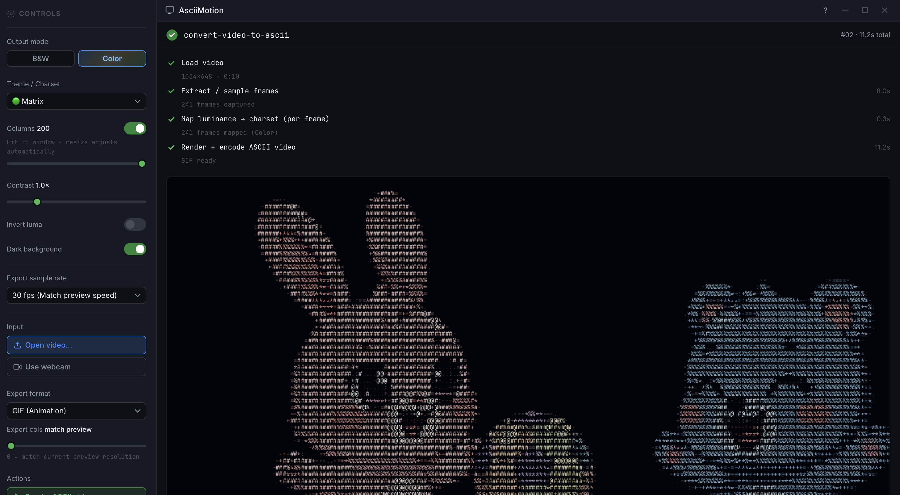
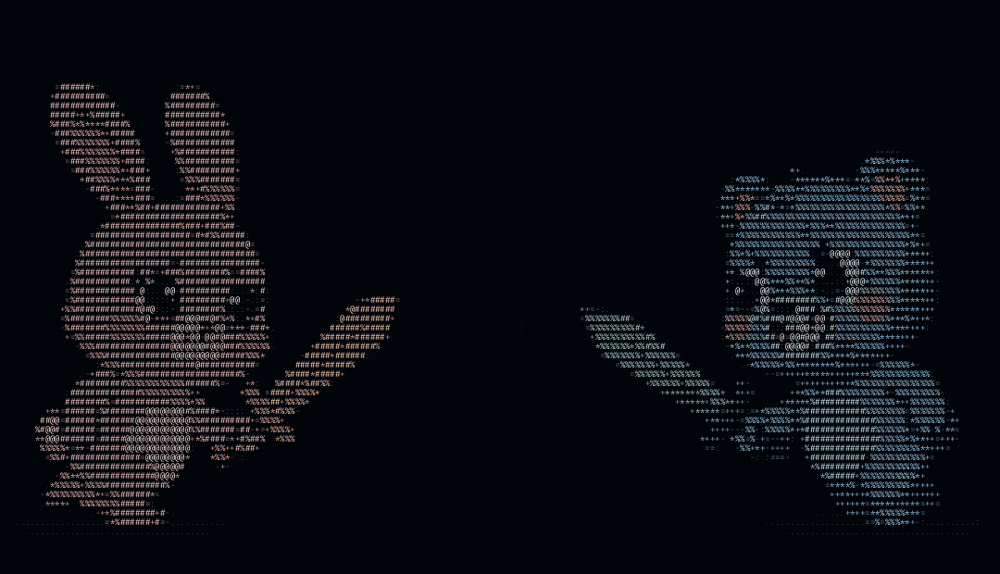

<div align="center">

  

  #  AsciiMotion

  ### Convert Any Video to Real-Time ASCII Art in Your Browser

  [](https://developer.mozilla.org/en-US/docs/Web/HTML)
  [](https://developer.mozilla.org/en-US/docs/Web/JavaScript)
  [](https://developer.mozilla.org/en-US/docs/Web/CSS)
  [](LICENSE)
  [](index.html)

  <p align="center">
    <b>AsciiMotion</b> is a high-performance, client-side web application that converts local videos and live webcam streams into vibrant ASCII art in real-time. Features live playback, monochrome terminal themes, 24-bit per-pixel RGB color rendering, high-definition video export (WebM/MP4), animated GIF creation, and standalone HTML embeds — all processed 100% in your browser.
  </p>

  <br />

  

</div>

---

##  Key Features

| Feature | Description |
| :--- | :--- |
|  **Full-Color & B&W Modes** | Toggle between vibrant 24-bit per-pixel RGB color matrix and classic terminal monochrome. |
| **Real-Time Live Playback** | Powered by `requestVideoFrameCallback` for 0-jitter, frame-synchronised ASCII video streaming. |
|  **Braille Subpixel Engine** | High-resolution 2×4 dot matrix subpixel encoding for razor-sharp ASCII visuals. |
|  **Multi-Format Export** | Export ASCII videos in HD WebM, MP4, animated GIF, or raw frame sequence (`.json`). |
|  **Live Webcam Stream** | Turn your web camera into a live ASCII video source with real-time recording support. |
|  **Auto-Fit & Custom Resolution** | Automatically adapts character column density to your browser window or set manual columns (20–200). |
|  **Instant PNG Snapshots** | Capture pixel-perfect high-resolution PNG snapshots of any ASCII frame with one click. |
|  **Standalone HTML Embeds** | Export self-contained HTML widgets or iframe snippets that play offline anywhere. |
|  **Intuitive Hotkeys** | Full keyboard control for playback, seeking, volume adjustment, fullscreen, and snapshots. |
| **100% Private & Serverless** | All frame sampling, luminance mapping, and encoding run locally in your browser. Zero data uploaded. |

---

## Character Sets & Themes

AsciiMotion includes pre-tuned themes and classic character ramps designed for maximum contrast and visual density:

- **Matrix Terminal** — Signature green-on-black terminal typography (`@#%*+=-:. `)
- **▓ Retro IBM** — Classic MS-DOS shaded block characters (`█▓▒░ `)
- **⣿ Braille (Hi-Res)** — Ultra-dense 2×4 subpixel dot grid (`0x2800..0x28FF`)
- **Detailed** — 10-level luminance character gradient (`@%#*+=-:. `)
- **Simple** — Clean high-contrast ASCII ramp (`#*+-:. `)
- **Blocks** — Block shading ramp (`█▓▒░ `)
- **Binary** — Digital matrix stream (`01 `)

---

##  Quick Start Guide

### 1. Run Locally
No build tools or installation required! Simply clone the repository and open `index.html` in any modern browser:

```bash
git clone https://github.com/SonaliDuvesh/AsciiMotion.git
cd AsciiMotion

# Open index.html directly or serve using Python:
python3 -m http.server 8080
```
Navigate to `http://localhost:8080` in Chrome, Edge, or Firefox.

### 2. Using the Application
1. **Load Video**: Drag & drop any `.mp4`, `.webm`, or `.mov` file onto the app window, or click **Open video…**. Alternatively, click **Use webcam** for live camera capture.
2. **Customize Aesthetics**: Switch between **Color** and **B&W** modes, change character themes, adjust contrast sliders, or toggle dark/light backgrounds.
3. **Render Video**: Select your desired format (**WebM**, **MP4**, or **GIF**) and sample frame rate, then click **Render ASCII video**.
4. **Download & Share**: Automatically downloads the encoded video file or click **Share / Embed** to generate standalone HTML files.

---

## ⌨️ Keyboard Shortcuts

| Key | Action |
| :--- | :--- |
| <kbd>Space</kbd> | Play / Pause video or export preview |
| <kbd>←</kbd> / <kbd>→</kbd> | Seek backward / forward 5 seconds |
| <kbd>↑</kbd> / <kbd>↓</kbd> | Volume up / down 10% |
| <kbd>M</kbd> | Toggle Mute / Unmute |
| <kbd>F</kbd> | Toggle Fullscreen preview |
| <kbd>S</kbd> | Take instant PNG snapshot |
| <kbd>Esc</kbd> | Exit Fullscreen mode |
| <kbd>?</kbd> (Shift + /) | Open Keyboard Shortcuts dialog |

---

##  Technology Stack

- **Frontend Core**: HTML5, Vanilla JavaScript (ES6+), Vanilla CSS3
- **Graphics Pipeline**: Canvas 2D API (`willReadFrequently`, pixel-perfect monospace font rendering)
- **Video Clock**: `HTMLVideoElement.requestVideoFrameCallback()` with fallback to `requestAnimationFrame`
- **Encoding Engine**: Browser `MediaRecorder` API for WebM/MP4 & Multi-threaded `gif.js` Web Workers for GIF rendering

---

## 📁 Repository Structure

```
AsciiMotion/
├── index.html                   # Main application shell & GTK pipeline interface
├── style.css                    # Dark CI/CD pipeline aesthetics & responsive styling
├── app.js                       # Frame extraction, luminance mapping & video export engine
├── features.js                  # Webcam streaming, keyboard hotkeys & share modals
├── gif.js                       # GIF encoding library
├── gif.worker.js                # Multi-threaded Web Worker for GIF quantization
└── assets/
    ├── header.png               # Banner image
    ├── demo.gif                 # Demo preview animation
    └── demo.mp4                 # Full video demo
```

---


